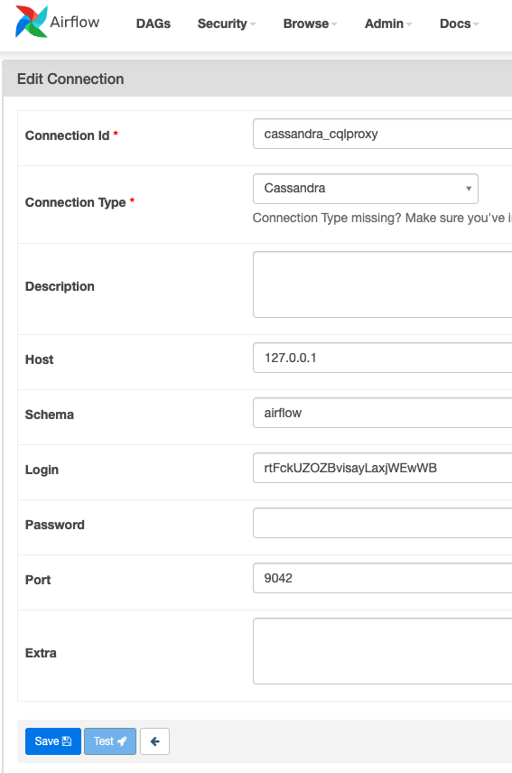
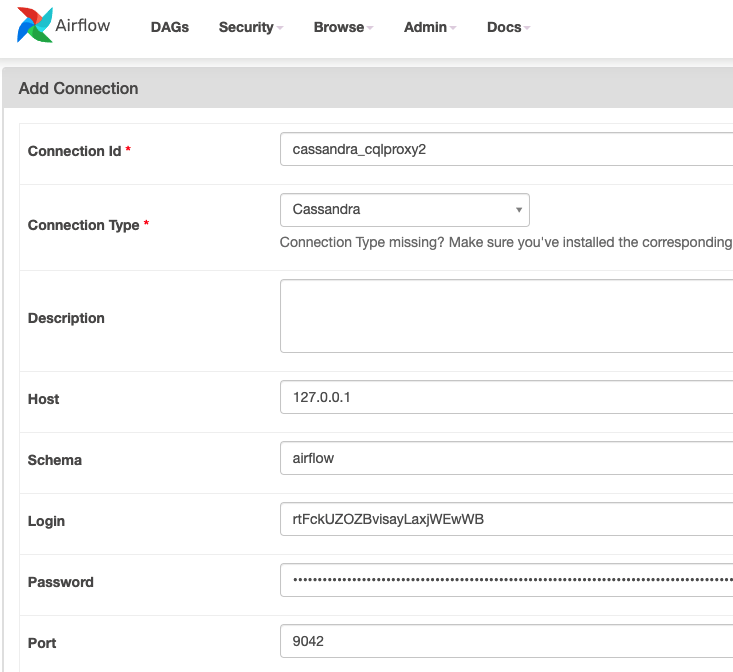

# Connecting Astra DB to Apache Airflow with cql-proxy


[🏠 Back to LIST](../README.MD)

## Overview

Apache Airflow is an open source workflow management system.  It provides components which allow engineers to build data pipelines between different systems.  These instructions will step through tasks/adjustments to be done in each product (Astra DB, cql-proxy, Apache Airflow), ultimately resulting in Airflow being able to work with AstraDB in its directed acyclic graphs (DAG).

- ℹ️ [Apache Airflow Documentation](https://airflow.apache.org/docs/apache-airflow/stable/index.html)

## Prerequisites

- [Create an Astra Database](../astra/CREATE-AN-INSTANCE.MD)

- [Create an Astra Token](../astra/CREATE-A-TOKEN.MD)

- [Download and install Apache Airflow](https://airflow.apache.org/docs/apache-airflow/stable/installation/index.html)

This article was written for Apache Airflow version `2.2.3` on `MacOS` with Python `3.9`.

## DataStax Astra DB
### Create the keyspace
From the [Astra DB dashboard](https://astra.datastax.com), click on your database name.  Scroll down to where the keyspaces are listed, and click the "Add Keyspace" button to create a new keyspace.  Name this keyspace “airflow.”

### Download the secure bundle
Next, click the “Connect” tab.  Under “Connect using a driver” section, select from any of the languages listed below.  Click the big, blue button labeled “Download Bundle” as shown in figure 1.


Figure 1 - Downloading the Secure Connect Bundle

## cql-proxy
DataStax’s cql-proxy is designed to function as an intermediate connection point to allow legacy Apache Cassandra applications to connect to DataStax Astra DB using its new Secure Connect Bundle.  There are a few ways to install and run DataStax’s cql-proxy, as outlined in its [GitHub README](https://github.com/datastax/cql-proxy/).

Be sure to start cql-proxy with the following settings:
 - Using the Secure Connect Bundle downloaded in the previous section
 - Binding it to the listen IP of the server instance
 - Specifying the username of “token”
 - Specifying the Astra Token created for the user in Astra DB as the password

You can run cql-proxy (in the foreground) from the command line in this way, like this:
```
./cql-proxy --bundle ~/local/astraCreds/secure-connect.zip \
    --bind 127.0.0.1 \
    --username token \
    --password AstraCS:rtFckUZblahblahblahblahblahblaha3953d799a525
```
Important to note that the command shown above binds cql-proxy to localhost (127.0.0.1), meaning it is not reachable (by Airflow) from outside the server instance.

## Apache Airflow
### Create a new connection
Inside Apache Airflow, click `Connections` from underneath the `Admin` drop-down menu.  Then click on the blue button labeled with the plus sign (`+`) to add a new connection.  Fill out the form as shown in Figure 2:

 - Connection Id: A unique identifier for the connection in Apache Airflow, which will be referenced inside the DAG code.  We will use “cassandra_cqlproxy.”
 - Connection Type: Select “Cassandra” from the drop-down.  If it is not present, you will have to install Airflow’s Cassandra provider.
 - Host: The listen address that cql-proxy is bound to.  In this case, that is “127.0.0.1.”
 - Schema: The Cassandra keyspace which we created in Astra DB.  We’ll set that to “airflow” in this case.
 - Login: Your Astra DB client id.
 - Password: Your Astra DB client secret.
 - Port: The port that cql-proxy is listening on for the CQL native binary protocol, most likely 9042.


Figure 2 - Create a new Cassandra connection for Apache Airflow.

Click the blue “Save” button to persist the new connection.

### Create a new DAG
A directed acyclic graph (DAG) is essentially a Python script which imports one or more libraries specific to Airflow.  To create a new DAG, first locate your DAG directory.  By default, Airflow looks for custom DAGs in the `~/airflow/dags/` directory.

For testing, there is a sample DAG out in the following GitHub repository:
https://github.com/aar0np/DS_Python_stuff/blob/main/cassandra_test_dag.py

This DAG uses the following line to reference the Cassandra connection we created in the above step:
```
hook = CassandraHook('cassandra_cqlproxy')
```

The other important aspect is that this DAG sets its unique identifier as `cass_hooks_tutorial`:
```
with DAG(
    'cass_hooks_tutorial',
```

It also specifically creates two unique tasks:
 - `check_table_exists`
 - `query_system_local`

### Testing
To test the connection, copy the DAG mentioned above into the /dags/ directory.  Then we will invoke Airflow’s task testing functionality, by running airflow tasks test and specifying:
 - The DAG’s unique identifier
 - The name of the task to be run
 - The execution date

If today’s date is 2022-02-08, the command looks like this:
```
airflow tasks test cass_hooks_tutorial check_table_exists 2022-02-08
```

Many messages will go by quickly.  If it worked, the final messages should look something like this:
```
INFO - Done. Returned value was: True
INFO - Marking task as SUCCESS. dag_id=cass_hooks_tutorial, task_id=check_table_exists, execution_date=20220208T000000, start_date=20220208T195333, end_date=20220208T195334
```

## Acknowledgements
Special thanks goes out to Obioma Anomnachi of Anant.  Obi’s [video](https://www.youtube.com/watch?v=h2OCveciEIA) and [GitHub repo](https://github.com/anomnaco/AirflowCassandra) proved quite helpful in building out this tutorial.
