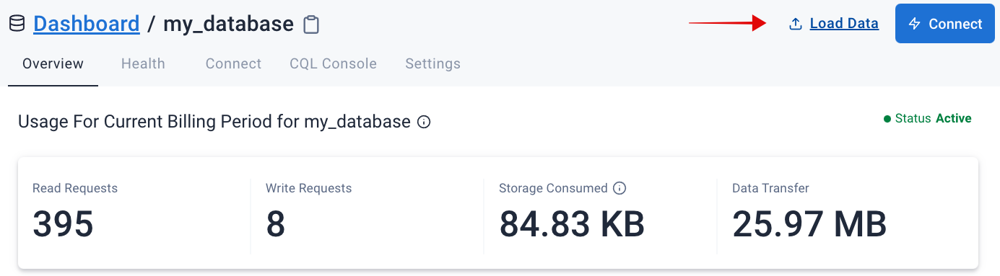
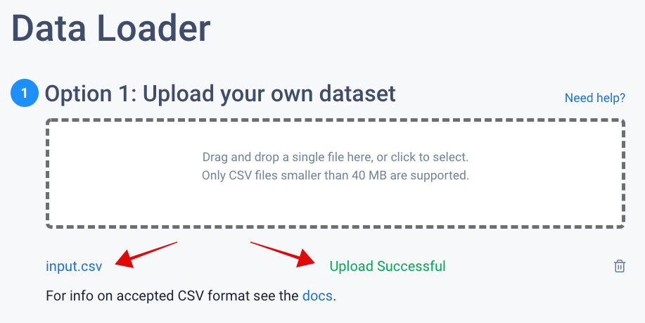
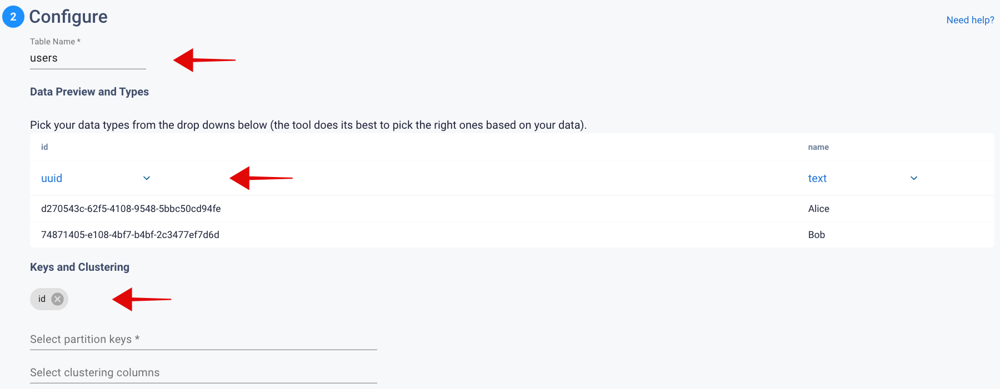
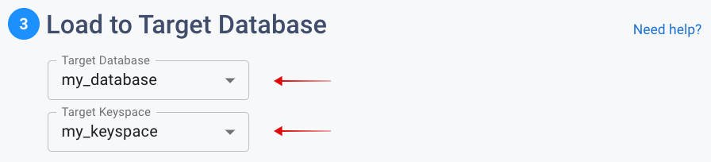

# Using Astra DB Data Loader

[🏠 Back to home](https://github.com/datastaxdevs/awesome-astra/wiki) | Written by **Artem Chebotko** 

> [Reference documentation for Astra DB Data Loader](https://docs.datastax.com/en/astra/docs/astra-data-loader.html)


**📋 On this page**
- [A - Overview](#a---overview)
- [B - Prerequisites](#b---prerequisites)
- [C - Usage Example](#c---usage-example)

## A - Overview

### 📘 What is Astra DB Data Loader?

*Astra DB Data Loader* is an easy-to-use tool for loading datasets into Astra DB with a few clicks. Astra DB Data Loader comes with Web UI that is integrated into the Astra DB database service dashboard.

Astra DB Data Loader is commonly used to:

- Load data from CSV files to a database in Astra DB;
- Load predefined example datasets to a database in Astra DB;
- Load data exported from DynamoDB to a database in Astra DB.

For more information about the Astra DB Data Loader capabilities, please see the [reference documentation](https://docs.datastax.com/en/astra/docs/astra-data-loader.html).

### 📘  Data size limits

Astra DB Data Loader can load a CSV file of up to `40`MB at a time. Large files may need to be split into smaller ones before data loading. 
Alternatively, to loading larger files, we recommend using [DSBulk](https://github.com/datastaxdevs/awesome-astra/wiki/Using-DSBulk-with-Astra). 

The size limit does not apply to DynamoDB data.

## B - Prerequisites

- [Create an Astra Account](http://astra.datastax.com/)
- [Create an Astra Database](https://github.com/datastaxdevs/awesome-astra/wiki/Create-an-AstraDB-Instance)

## C - Usage Example

Access Astra DB Data Loader by going to [Astra DB Dashboard](http://astra.datastax.com/), selecting a database, and clicking on **Load Data**.



Astra DB Data Loader has a simple 3-step workflow.


### ✅ Step 1: Specify a dataset to load

To upload a CSV file, drag and drop it into the **Option 1: Upload your own dataset** field:




Example CSV file:

```csv
id,name
d270543c-62f5-4108-9548-5bbc50cd94fe,Alice
74871405-e108-4bf7-b4bf-2c3477ef7d6d,Bob
```

Besides **Option 1**, there are also **Option 2: Load an example dataset** and **Option 3: Load data from DynamoDB** for you to explore.

Click **Next** to continue.

### ✅ Step 2: Configure a target table schema

Customize a new table name, column data types, and partition and clustering keys:



Click **Next** to continue.

### ✅ Step 3: Specify a target database and a keyspace

Choose a database and a keyspace for the new table and dataset to be created and loaded: 



Click **Next** to continue.

For small datasets, data loading usually takes a couple of minutes to complete:


